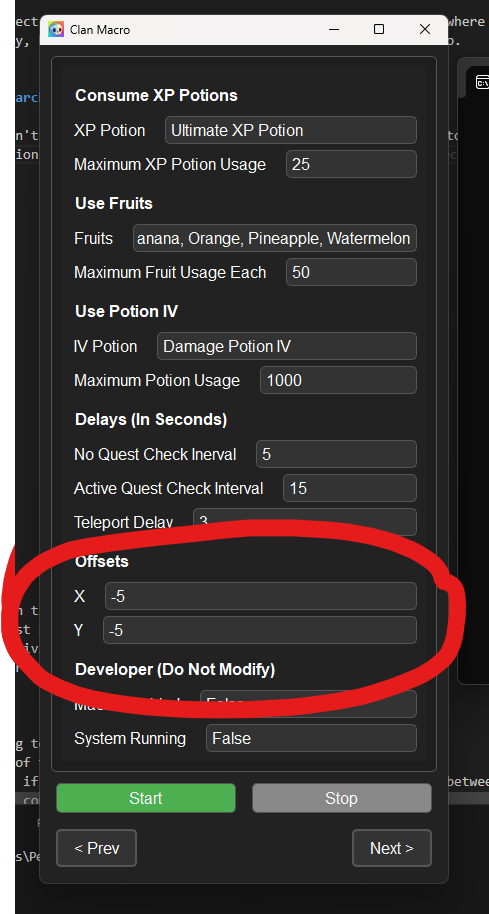

# How to Use
1. Download the zip file and extract the files.
2. You should end up with 2 files in your directory, `Clan Macro.exe` and `config.ini`.
3. Ensure you are using a 16:9 aspect ratio monitor (If you are unsure what this is, read [Common Resolutions](#common-resolutions)).
4. If you aren't, you need to go into your display settings and change it to a 16:9 resolution.
5. Relaunch Roblox and keep it where it is when you first join. Do not move the camera angle, as this will mess up the macro. Ensure that you are in windowed fullscreen, and not in total fullscreen. Your camera mode in the roblox settings should be set to classic, not follow.
6. Make sure that Autofarm is disabled and Auto Hatch is **enabled**.
7. Run `Clan Macro.exe` and enter the correct password. You will be taken to a configuration page where you can modify settings to your liking. Once you are ready, hit the green start button and it will start the macro.

## FAQ
**Q: The cursor is missing the teleport search bar, is it broken?**

A: No it isn't broken. Because Roblox doesn't resize everything correctly, the position of the buttons can vary on each monitor, even if they are the same resolution. To fix the issue, open your config and modify the Y offset config to a higher negative number. If it is missing in the other direction, modify the X offset to a higher negative or positive number, based on your needs.

**Q: I discovered a bug, how do I report it?**

A: You can report bugs or make suggestions through the [google form](https://forms.gle/B4PQVBNQU6Lw5yEp8).

**Q: My computer auto deletes the file before I can run it, why is that happening?**

A: Most likely, it is because it was incorrectly flagged as malware. This is due to the fact that it is a compiled python script, and it requires the ability to simulate keyboard and mouse input. This is a false flag. The macro is completely safe and it doesn't require administrator privileges to run it. If you still have concerns, feel free to reach out to me on discord (@ybicg), and I can walk you through the source code so that you feel more comfortable.

## Common 16:9 Aspect Ratio Resolutions
| Width | Height | Name    |
|-------|--------|---------|
| 640   | 360    | nHD     |
| 854   | 480    | FWVGA   |
| 960   | 540    | qHD     |
| 1024  | 576    | WSVGA   |
| 1280  | 720    | HD      |
| 1366  | 768    | FWXGA   |
| 1600  | 900    | HD+     |
| 1920  | 1080   | Full HD |
| 2560  | 1440   | QHD     |
| 3200  | 1800   | QHD+    |
| 3840  | 2160   | 4K UHD  |
| 5120  | 2880   | 5K      |
| 7680  | 4320   | 8K UHD  |

# Releases
## Release 1.0.1
### Added
- Added a UI.
- Added configurations for individual spawn times per item.
- Focuses on Quest 4, and will only do Quest 3 if Quest 4 isn't valid.
- Fixes AFK kick after 20 minutes for inactivity (mostly).
- AFK's in the final area while waiting for an active quest.
- Farms the last area while hatching eggs.
### Removed
- None

## Release 1.0.0 (Beta)
### Beta Released

# To Do:
- Fix movement when hatching eggs and going to VIP area.
- During item quests, if there is no more of the item, do another quest.
- Add multi quest doing at once (basically if the quests are lucky block and comet, it alternates between each one).
- Add TNT in the breaking breakables quest configuration.